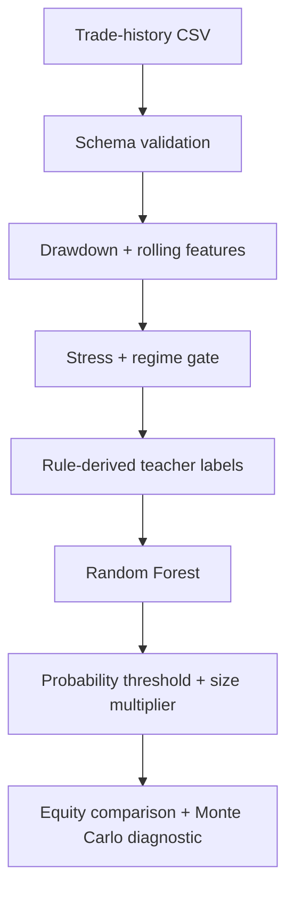

<p align="center">
  
</p>

<p align="center">
  <a href="https://github.com/TenchiNeko/ml-trading-bot/actions/workflows/ci.yml"></a>
  
  <a href="LICENSE"></a>
  
  
</p>

<p align="center"><strong>An offline research pipeline for testing drawdown-gated position-size reductions with a Random Forest classifier.</strong></p>

<p align="center">
  <a href="#what-it-does">What it does</a> ·
  <a href="#quick-start">Quick start</a> ·
  <a href="#input-schema">Input schema</a> ·
  <a href="#method">Method</a> ·
  <a href="#limitations">Limitations</a>
</p>

> [!CAUTION]
> This repository is for software research and education—not financial advice or a production risk system. It does not place trades, connect to a broker, or guarantee that a strategy has an edge. Trading can result in substantial loss.

## What it does

Panic Cop reads an existing trade-history CSV, engineers drawdown and loss-streak features, trains a classifier on rule-derived labels, and evaluates whether selectively reducing position size would have changed the recorded equity path.

| Capability | Boundary |
| --- | --- |
| Feature engineering | Drawdown, loss streak, rolling return, and rolling volatility features |
| Eligibility gate | Evaluates only configured stress conditions and the selected market regime |
| Classification | `RandomForestClassifier` trained on panic-eligible rows |
| Position sizing | Applies a configurable multiplier when predicted probability crosses a threshold |
| Monte Carlo diagnostic | Compares the selected panic locations with random eligible locations |
| Execution | Offline CSV analysis only—no orders, exchange APIs, credentials, or network access |

## Quick start

```bash
git clone https://github.com/TenchiNeko/ml-trading-bot.git
cd ml-trading-bot

python3 -m venv .venv
source .venv/bin/activate
python -m pip install -r requirements.txt

cp example_config.json config.json
python ml_panic_cop.py path/to/trades.csv --config config.json --output results.csv
```

The repository intentionally does not include real trading data. Use your own local dataset or a synthetic fixture that follows the schema below. See [QUICK_START.md](QUICK_START.md) for a shorter operating checklist.

## Input schema

The input CSV must contain these columns:

| Column | Type | Meaning |
| --- | --- | --- |
| `date` | Date/time | Any value accepted by `pandas.to_datetime` |
| `ret_pct` | Number | Per-trade return in percentage points; `-1.5` means −1.5% |
| `size_final` | Number | Baseline position-size multiplier |
| `q_confidence` | Number | Upstream signal-confidence feature |
| `volume_ratio_x` | Number | Upstream volume-ratio feature |
| `regime_x` | String | Market-regime label; the default gate expects `bull_trending` |

Rows missing any required value are dropped. The pipeline stops with a clear error if no usable rows remain.

## Usage

```text
usage: ml_panic_cop.py [-h] [--output OUTPUT] [--config CONFIG] input_file
```

```bash
# Default configuration and output path (ml_panic_results.csv)
python ml_panic_cop.py trades.csv

# Explicit paths
python ml_panic_cop.py trades.csv \
  --config example_config.json \
  --output results.csv
```

The pipeline can also be called as a module:

```python
from ml_panic_cop import PanicCopML

bot = PanicCopML(
    {
        "panic_mult": 0.50,
        "prob_threshold": 0.75,
        "dd_gate": -0.15,
    }
)

result = bot.run_full_pipeline("trades.csv", "results.csv")
print(result["performance"])
```

## Method



### 1. Feature engineering

The pipeline derives:

- `eq_4x` — compounded baseline equity path
- `dd_4x` — drawdown from the running equity peak
- `loss_streak` — consecutive negative sized returns
- `roll_loss3` — three-trade rolling mean
- `roll_std5` — five-trade rolling standard deviation

### 2. Eligibility and labels

With the defaults, a row becomes eligible when:

```python
(drawdown <= -0.15 or loss_streak >= 6) and regime_x == "bull_trending"
```

An eligible row receives the positive teacher label when the deeper drawdown and loss conditions are also met. These labels encode the configured rule—they are not independent ground truth.

### 3. Model and sizing

The classifier trains on the chronological training portion of eligible rows. A row receives reduced sizing when its predicted panic probability is at least `prob_threshold`; the baseline size is then multiplied by `panic_mult`.

### 4. Monte Carlo diagnostic

The diagnostic holds the number of panic decisions constant, randomly moves those decisions among eligible rows, and compares ending equity. The configured `random_state` makes these samples reproducible.

## Configuration

Copy [`example_config.json`](example_config.json) and override only the values you intend to test.

| Setting | Default | Purpose |
| --- | ---: | --- |
| `panic_mult` | `0.50` | Position-size multiplier when panic is active |
| `prob_threshold` | `0.75` | Minimum predicted probability |
| `dd_gate` | `-0.15` | Drawdown eligibility threshold |
| `loss_gate` | `6` | Loss-streak eligibility threshold |
| `teacher_dd` | `-0.20` | Drawdown threshold for positive labels |
| `teacher_loss` | `3` | Loss-streak threshold for positive labels |
| `teacher_bigloss` | `-0.05` | Sized-return threshold for positive labels |
| `train_split` | `0.70` | Chronological eligible-row training fraction |
| `n_runs_mc` | `2000` | Monte Carlo comparison runs |
| `rf_n_estimators` | `300` | Number of Random Forest trees |
| `rf_max_depth` | `4` | Maximum tree depth |
| `random_state` | `42` | Random Forest and Monte Carlo seed |

## Output

The output CSV includes the original usable rows plus engineered and decision columns:

- `eq_4x`, `dd_4x`, `loss_streak`, `roll_loss3`, and `roll_std5`
- `panic_eligible` and `teacher_panic`
- `panic_prob` and `panic_flag_ml`
- `size_ml_panic`

The terminal summary reports baseline and adjusted ending equity, maximum drawdown, and the Monte Carlo comparison statistics. Output CSV files are ignored by Git by default.

## Limitations

- The current report applies the trained classifier across the supplied dataset, including its training region. Treat the comparison as an in-sample research diagnostic, not an out-of-sample performance claim.
- The Monte Carlo comparison tests random placement among eligible rows; it does not prove future profitability or causal edge.
- Teacher labels come from configured rules and can reproduce those assumptions rather than discover a new signal.
- Transaction costs, slippage, liquidity, taxes, latency, and broker constraints are not modeled.
- Regime and upstream feature quality are the caller's responsibility.
- A statistically interesting result still requires walk-forward testing, holdout evaluation, and paper trading before any real-world consideration.

## Data safety

The program does not need credentials or internet access. Keep datasets and generated artifacts local:

- do not commit real trade histories, account identifiers, or performance exports
- do not commit broker credentials, API keys, `.env` files, or private configuration
- do not commit serialized models trained on private data
- inspect staged files before every push

The repository's `.gitignore` covers common data, model, database, credential, and result formats. Review [SECURITY_CHECKLIST.md](SECURITY_CHECKLIST.md) for the public-repository checklist.

## Project layout

| Path | Purpose |
| --- | --- |
| `ml_panic_cop.py` | CLI and research pipeline |
| `example_config.json` | Safe configuration template |
| `tests/` | Deterministic unit tests with synthetic data |
| `QUICK_START.md` | Concise setup and run checklist |
| `SECURITY_CHECKLIST.md` | Data and secret handling guidance |
| `.github/workflows/ci.yml` | Python 3.10 and 3.12 verification |

## Development

```bash
python -m compileall -q ml_panic_cop.py tests
python -m unittest discover -s tests -v
python ml_panic_cop.py --help
```

Contributions are welcome. Read [CONTRIBUTING.md](CONTRIBUTING.md) before opening a pull request, and use only synthetic or redistributable test data.

## License

Panic Cop is available under the [MIT License](LICENSE).
